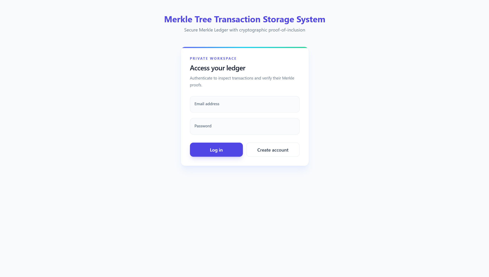
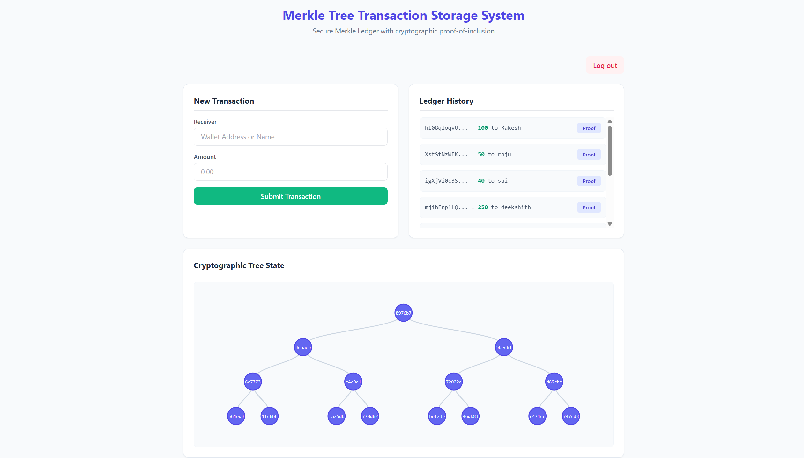

# Merkle Tree Transaction Storage System

A secure, full-stack web application that stores financial transactions in a SQLite database and builds a cryptographic Merkle tree to guarantee data integrity. It features a decoupled Flask REST API, secure user authentication, and an interactive frontend powered by Tailwind CSS and D3.js for real-time tree visualization.




## Core Features

- **Cryptographic Data Integrity:** Builds a SHA-256 Merkle tree from stored transactions to detect unauthorized alterations.
- **Proof-of-Inclusion API:** Generates Merkle proofs for individual transactions, allowing verifiers to validate data without downloading the entire ledger.
- **Interactive Visualization:** Renders a responsive, top-down Merkle tree hierarchy using D3.js, complete with hover tooltips for full hash inspection.
- **Secure Authentication:** Implements HTTP-only sessions, bcrypt password hashing, and protected RESTful API endpoints.
- **Modern UI/UX:** Features a responsive dashboard styled with Tailwind CSS.
- **Decoupled Architecture:** Separates the Flask backend from the static frontend through a REST API with local CORS support.

## Tech Stack

- **Backend:** Python 3.11+, Flask, Flask-SQLAlchemy, SQLite, bcrypt, Flask-CORS
- **Frontend:** Vanilla JavaScript, Tailwind CSS via CDN, D3.js
- **Cryptography:** SHA-256 hashing algorithms

## Project Structure

```text
backend/
  app.py                 # Application factory and CORS/session configuration
  models.py              # SQLAlchemy User and Transaction models
  routes/api.py          # JSON REST endpoints for auth, transactions, and proofs
  services/crypto.py     # Canonical JSON, hashing, tree building, and proofs
  services/anchor.py     # Signed external Merkle root/layer anchor
frontend/
  index.html             # Tailwind-styled dashboard and login UI
  app.js                 # Async REST client and D3.js tree visualization
  styles.css             # Custom utility styles
docker-compose.yml       # Container orchestration for backend and frontend
requirements.txt         # Python dependencies
```

## Local Setup & Installation

Create and activate a virtual environment:

```powershell
python -m venv .venv
.\.venv\Scripts\Activate.ps1
```

Install the dependencies:

```powershell
python -m pip install -r requirements.txt
```

## Running the Application

Open two PowerShell terminals from the project root.

**Terminal 1: Start the Flask API**

```powershell
.\.venv\Scripts\Activate.ps1
python -m backend.app
```

**Terminal 2: Start the Frontend UI**

```powershell
cd frontend
python -m http.server 8000
```

Open [http://127.0.0.1:8000](http://127.0.0.1:8000) in your browser. The frontend communicates with the API at `http://127.0.0.1:5000` and includes credentials for the HTTP-only session cookie.

Do not run this project using `streamlit run app.py`.

## API & Merkle Proofs

Use the **Proof** button beside any ledger transaction, or query the REST API directly:

```http
GET /api/proof/<transaction_id>
```

Example:

```text
http://127.0.0.1:5000/api/proof/T1
```

The response contains the transaction, its leaf index, the current Merkle root, and the sibling path required to rebuild the hash up to the root. A verifier can use `verify_merkle_proof()` from `backend.services.crypto` to validate the transaction cryptographically.

Authentication endpoints are available at:

```text
POST /api/auth/register
POST /api/auth/login
POST /api/auth/logout
```

Transactions are created through `POST /api/transactions` and the current tree is available through `GET /api/tree`.

## Docker Deployment

To run the containerized stack, define `SECRET_KEY` and `MERKLE_ANCHOR_SECRET` in `.env`, then run:

```powershell
docker-compose up --build
```

The Docker frontend is exposed on port `8080` and the API on port `5000`.

## License

This project is intended for educational and portfolio use.
